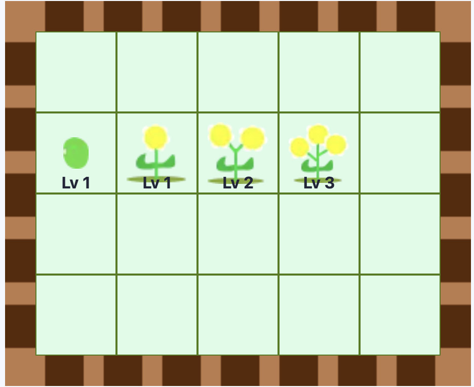

# Bloom Boom Bloomville
An on-chain game where players build gardens, plant and grow flowers, and earn bloom points



⚙️ Built using NextJS, RainbowKit, Hardhat, Wagmi, Viem, and Typescript.

## Gameplay

- Buy and mint a garden as an NFT.

- Plant a seed in your garden.

- Water your seed to grow into a flower.

- You can collect bloom points from the flower.

- Level up your plant by using bloom points. By doing so, you'll earn more points.

- The plant needs to be watered each day, or someone can steal your plant and collect its bloom points.

- Buy and customize your garden with bloom points to purchase garden floor tiles.

## Requirements

Before you begin, you need to install the following tools:

- [Node (>= v18.17)](https://nodejs.org/en/download/)
- Yarn ([v1](https://classic.yarnpkg.com/en/docs/install/) or [v2+](https://yarnpkg.com/getting-started/install))
- [Git](https://git-scm.com/downloads)

## Quickstart

To get started with Bloom-Boom-Bloomville, follow the steps below:

1. Clone this repo & install dependencies

```
git clone https://github.com/codechefsong/Bloom-Boom-Bloomville.git
cd Bloom-Boom-Bloomville
yarn install
```

2. Run a local network in the first terminal:

```
yarn chain
```

This command starts a local Ethereum network using Hardhat. The network runs on your local machine and can be used for testing and development. You can customize the network configuration in `hardhat.config.ts`.

3. On a second terminal, deploy the test contract:

```
yarn deploy
```

This command deploys a test smart contract to the local network. The contract is located in `packages/hardhat/contracts` and can be modified to suit your needs. The `yarn deploy` command uses the deploy script located in `packages/hardhat/deploy` to deploy the contract to the network. You can also customize the deploy script.

4. On a third terminal, start your NextJS app:

```
yarn start
```

Visit your app on: `http://localhost:3000`. You can interact with your smart contract using the `Debug Contracts` page. You can tweak the app config in `packages/nextjs/scaffold.config.ts`.
